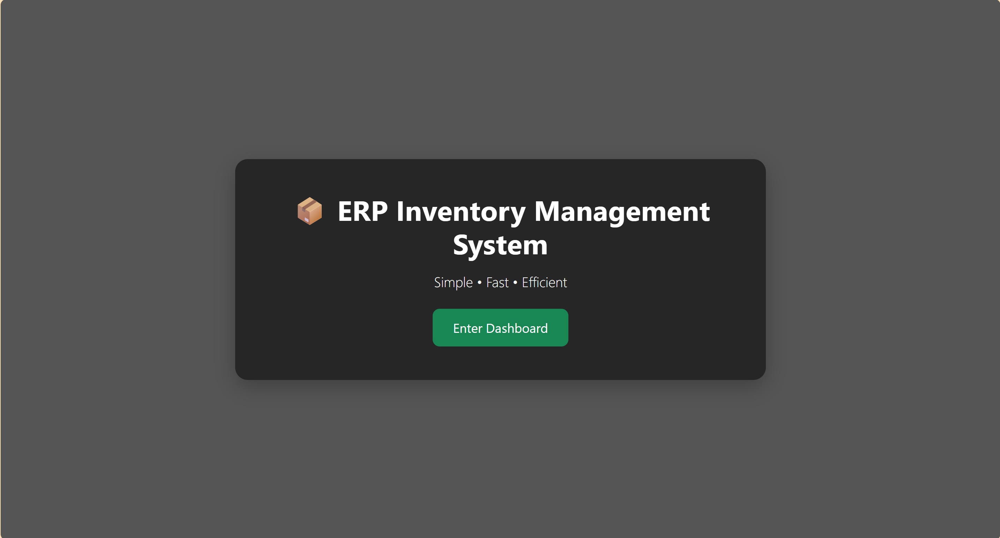
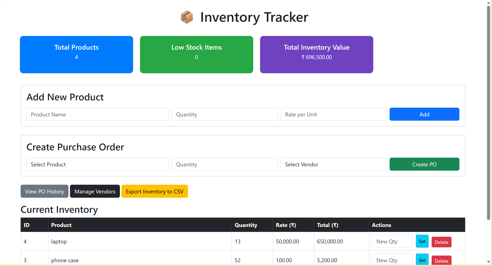
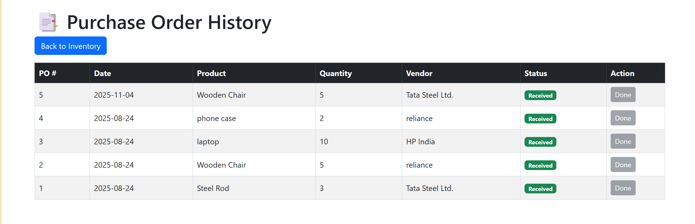
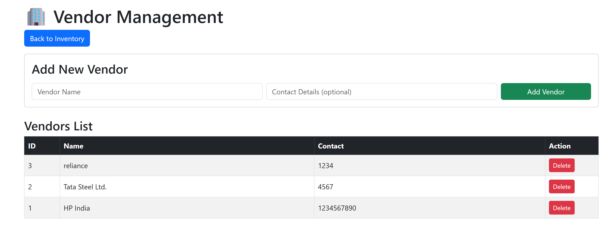
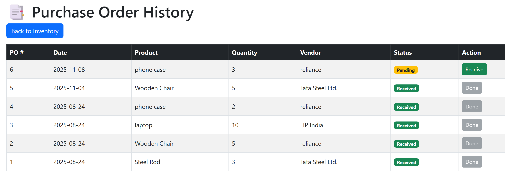

# Inventory-Management-System: 
A Flask-based web application designed to streamline inventory and material management operations. This project helps users manage stock, suppliers, and purchase orders efficiently — inspired by MM (Materials Management) workflows.

🚀 Features
Add, update, and delete products
Track stock levels and generate low-stock alerts
Manage suppliers and purchase records
Search and filter inventory data
Simple, responsive UI built with Bootstrap
Persistent database using SQLite

🛠️ Tech Stack
Frontend:HTML, CSS, Bootstrap
Backend:Flask (Python)
Database:SQLite

Screenshots:

🧩 Future Enhancements
🔹 Add user authentication and roles
🔹 Integrate with an external API for analytics
🔹 Include stock forecasting using ML models
🔹 Export reports to Excel or PDF
